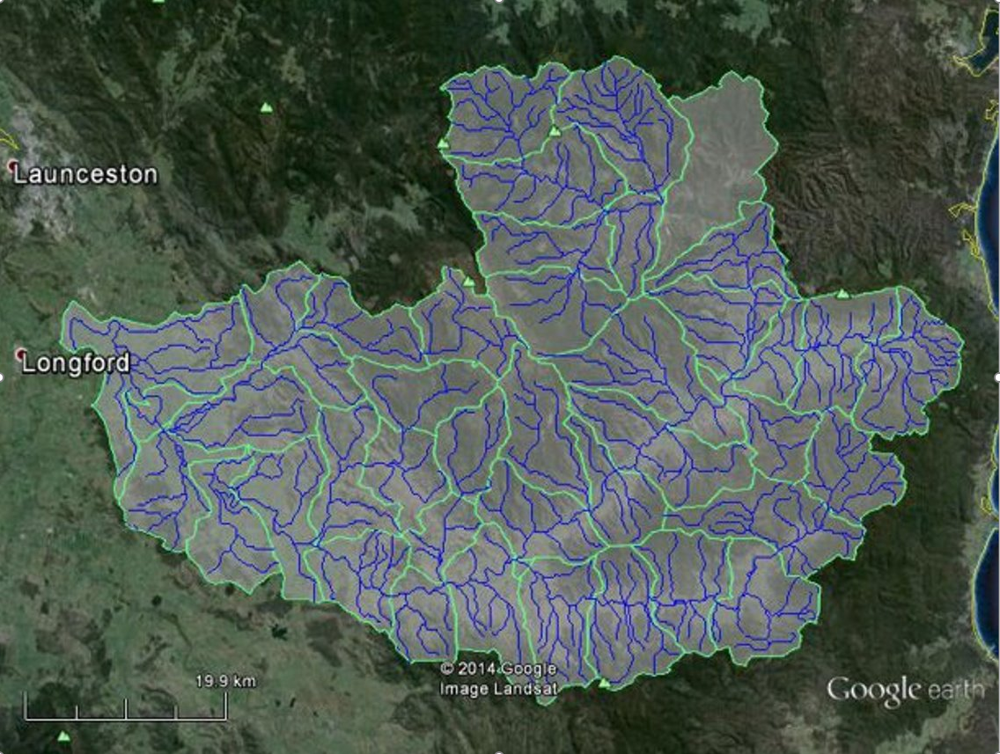

# Calibration of a catchment using multisite multiobjective composition


## About this document


```python
from swift2.doc_helper import pkg_versions_info

print(pkg_versions_info("This document was generated from a jupyter notebook"))
```

    This document was generated from a jupyter notebook on 2025-03-27 17:22:17.155498
        swift2 2.5.1
        uchronia 2.6.2


## Use case

This vignette demonstrates how one can calibrate a catchment using multiple gauging points available within this catchment. This only covers the definition of the calibration, **not the execution**. The sample data in the package is a small subset of hourly data to keep things (data size, execution time) small.

This is a joint calibration weighing multiple objectives, possibly sourced from different modelling objects in the semi-distributed structure, thus a whole-of-catchment calibration technique. A staged, cascading calibration is supported and described in another vignette.


```python
from swift2.utils import mk_full_data_id
from swift2.classes import CompositeParameteriser, HypercubeParameteriser, Simulation
# from swift2.wrap.ffi_interop import debug_msd
import xarray as xr
import pandas as pd
import numpy as np
import xarray as xr
```


```python

```


```python
import swift2.doc_helper as std
```


```python
import seaborn as sns
import matplotlib.pyplot as plt
```


```python
from cinterop.timeseries import TIME_DIMNAME, slice_xr_time_series, pd_series_to_xr_series, slice_xr_time_series, pd_series_to_xr_series
```


```python
from cinterop.timeseries import xr_ts_start, xr_ts_end
import datetime as dt
```


```python
%matplotlib inline
```

## Data

The sample data that comes with the package contains a model definition for the South Esk catchment, including a short subset of the climate and flow record data.



<!-- 
 -->


```python
model_id = 'GR4J'
site_id = 'South_Esk'
```


```python
se_climate = std.sample_series(site_id=site_id, var_name='climate')
se_flows = std.sample_series(site_id=site_id, var_name='flow')
```


```python
se_climate.head(3)
```


<div>
<style scoped>
    .dataframe tbody tr th:only-of-type {
        vertical-align: middle;
    }

    .dataframe tbody tr th {
        vertical-align: top;
    }

    .dataframe thead th {
        text-align: right;
    }
</style>
<table border="1" class="dataframe">
  <thead>
    <tr style="text-align: right;">
      <th></th>
      <th>subcatchment.1.E</th>
      <th>subcatchment.1.P</th>
      <th>subcatchment.10.E</th>
      <th>subcatchment.10.P</th>
      <th>subcatchment.11.E</th>
      <th>subcatchment.11.P</th>
      <th>subcatchment.12.E</th>
      <th>subcatchment.12.P</th>
      <th>subcatchment.13.E</th>
      <th>subcatchment.13.P</th>
      <th>...</th>
      <th>subcatchment.5.E</th>
      <th>subcatchment.5.P</th>
      <th>subcatchment.6.E</th>
      <th>subcatchment.6.P</th>
      <th>subcatchment.7.E</th>
      <th>subcatchment.7.P</th>
      <th>subcatchment.8.E</th>
      <th>subcatchment.8.P</th>
      <th>subcatchment.9.E</th>
      <th>subcatchment.9.P</th>
    </tr>
  </thead>
  <tbody>
    <tr>
      <th>2010-11-01 00:00:00</th>
      <td>0.3918</td>
      <td>0.0</td>
      <td>0.4020</td>
      <td>0.0000</td>
      <td>0.3978</td>
      <td>0.0000</td>
      <td>0.4266</td>
      <td>0.0000</td>
      <td>0.3936</td>
      <td>0.0000</td>
      <td>...</td>
      <td>0.4325</td>
      <td>0.0</td>
      <td>0.4110</td>
      <td>0.0322</td>
      <td>0.4247</td>
      <td>0.0</td>
      <td>0.4377</td>
      <td>0.0</td>
      <td>0.4337</td>
      <td>0.0</td>
    </tr>
    <tr>
      <th>2010-11-01 01:00:00</th>
      <td>0.4385</td>
      <td>0.0</td>
      <td>0.4493</td>
      <td>0.0207</td>
      <td>0.4446</td>
      <td>0.0433</td>
      <td>0.4763</td>
      <td>0.0179</td>
      <td>0.4397</td>
      <td>0.0555</td>
      <td>...</td>
      <td>0.4823</td>
      <td>0.0</td>
      <td>0.4593</td>
      <td>0.0000</td>
      <td>0.4746</td>
      <td>0.0</td>
      <td>0.4892</td>
      <td>0.0</td>
      <td>0.4841</td>
      <td>0.0</td>
    </tr>
    <tr>
      <th>2010-11-01 02:00:00</th>
      <td>0.4614</td>
      <td>0.0</td>
      <td>0.4723</td>
      <td>0.0000</td>
      <td>0.4671</td>
      <td>0.0000</td>
      <td>0.5002</td>
      <td>0.0000</td>
      <td>0.4619</td>
      <td>0.0000</td>
      <td>...</td>
      <td>0.5060</td>
      <td>0.0</td>
      <td>0.4827</td>
      <td>0.0000</td>
      <td>0.4987</td>
      <td>0.0</td>
      <td>0.5143</td>
      <td>0.0</td>
      <td>0.5084</td>
      <td>0.0</td>
    </tr>
  </tbody>
</table>
<p>3 rows × 84 columns</p>
</div>


```python
se_climate.tail(3)
```


<div>
<style scoped>
    .dataframe tbody tr th:only-of-type {
        vertical-align: middle;
    }

    .dataframe tbody tr th {
        vertical-align: top;
    }

    .dataframe thead th {
        text-align: right;
    }
</style>
<table border="1" class="dataframe">
  <thead>
    <tr style="text-align: right;">
      <th></th>
      <th>subcatchment.1.E</th>
      <th>subcatchment.1.P</th>
      <th>subcatchment.10.E</th>
      <th>subcatchment.10.P</th>
      <th>subcatchment.11.E</th>
      <th>subcatchment.11.P</th>
      <th>subcatchment.12.E</th>
      <th>subcatchment.12.P</th>
      <th>subcatchment.13.E</th>
      <th>subcatchment.13.P</th>
      <th>...</th>
      <th>subcatchment.5.E</th>
      <th>subcatchment.5.P</th>
      <th>subcatchment.6.E</th>
      <th>subcatchment.6.P</th>
      <th>subcatchment.7.E</th>
      <th>subcatchment.7.P</th>
      <th>subcatchment.8.E</th>
      <th>subcatchment.8.P</th>
      <th>subcatchment.9.E</th>
      <th>subcatchment.9.P</th>
    </tr>
  </thead>
  <tbody>
    <tr>
      <th>2010-11-20 21:00:00</th>
      <td>0.1832</td>
      <td>0.0</td>
      <td>0.1885</td>
      <td>0.0000</td>
      <td>0.1865</td>
      <td>0.0000</td>
      <td>0.2004</td>
      <td>0.0</td>
      <td>0.1844</td>
      <td>0.0</td>
      <td>...</td>
      <td>0.2047</td>
      <td>0.0</td>
      <td>0.1940</td>
      <td>0.0</td>
      <td>0.1988</td>
      <td>0.0</td>
      <td>0.2035</td>
      <td>0.0</td>
      <td>0.2040</td>
      <td>0.0</td>
    </tr>
    <tr>
      <th>2010-11-20 22:00:00</th>
      <td>0.2809</td>
      <td>0.0</td>
      <td>0.2877</td>
      <td>0.1014</td>
      <td>0.2849</td>
      <td>0.0289</td>
      <td>0.3054</td>
      <td>0.0</td>
      <td>0.2814</td>
      <td>0.0</td>
      <td>...</td>
      <td>0.3104</td>
      <td>0.0</td>
      <td>0.2961</td>
      <td>0.0</td>
      <td>0.3035</td>
      <td>0.0</td>
      <td>0.3105</td>
      <td>0.0</td>
      <td>0.3098</td>
      <td>0.0</td>
    </tr>
    <tr>
      <th>2010-11-20 23:00:00</th>
      <td>0.3683</td>
      <td>0.0</td>
      <td>0.3762</td>
      <td>0.2028</td>
      <td>0.3727</td>
      <td>0.0577</td>
      <td>0.3990</td>
      <td>0.0</td>
      <td>0.3678</td>
      <td>0.0</td>
      <td>...</td>
      <td>0.4044</td>
      <td>0.0</td>
      <td>0.3872</td>
      <td>0.0</td>
      <td>0.3968</td>
      <td>0.0</td>
      <td>0.4061</td>
      <td>0.0</td>
      <td>0.4041</td>
      <td>0.0</td>
    </tr>
  </tbody>
</table>
<p>3 rows × 84 columns</p>
</div>


## Base model creation 


```python
simulation = std.sample_catchment_model(site_id=site_id, config_id='catchment')
# simulation = swap_model(simulation, 'MuskingumNonLinear', 'channel_routing')
simulation = simulation.swap_model('LagAndRoute', 'channel_routing')
```

The names of the climate series is already set to the climate input identifiers of the model simulation, so setting them as inputs is easy:


```python
simulation.play_input(se_climate)
simulation.set_simulation_span(xr_ts_start(se_climate), xr_ts_end(se_climate))
simulation.set_simulation_time_step('hourly')
```

Moving on to define the parameters, free or fixed. We will use (for now - may change) the package calibragem, companion to SWIFT.


```python
std.configure_hourly_gr4j(simulation)
```

## Parameterisation

We define a function creating a realistic feasible parameter space. The parameteriser is relatively sophisticated, but this is not the main purpose of this vignette, so we do not describe the process about defining and creating parameterisers in gread details. 


```python
from swift2.utils import c, paste0, rep
import swift2.parameteriser as sp
import swift2.helpers as hlp


def create_meta_parameteriser(simulation:Simulation, ref_area=250, time_span=3600):  
    time_span = int(time_span)
    parameteriser = std.define_gr4j_scaled_parameter(ref_area, time_span)
  
    # Let's define _S0_ and _R0_ parameters such that for each GR4J model instance, _S = S0 * x1_ and _R = R0 * x3_
    p_states = sp.linear_parameteriser(
                      param_name=c("S0","R0"), 
                      state_name=c("S","R"), 
                      scaling_var_name=c("x1","x3"),
                      min_p_val=c(0.0,0.0), 
                      max_p_val=c(1.0,1.0), 
                      value=c(0.9,0.9), 
                      selector_type='each subarea')
  
    init_parameteriser = p_states.make_state_init_parameteriser()
    parameteriser = sp.concatenate_parameterisers(parameteriser, init_parameteriser)
    
    hlp.lag_and_route_linear_storage_type(simulation)
    hlp.set_reach_lengths_lag_n_route(simulation)

    lnrp = hlp.parameteriser_lag_and_route()
    parameteriser = CompositeParameteriser.concatenate(parameteriser, lnrp, strategy='')
    return parameteriser


```


```python
parameteriser = create_meta_parameteriser(simulation)
```

We have built a parameteriser for jointly parameterising:

* GR4J parameters in transformed spaces ($log$ and $asinh$)
* GR4J initial soil moisture store conditions ($S_0$ and $R_0$)
* A "lag and route" streamflow routing scheme in transform space.

There is even more happening there, because on top of GR4J parameter transformation we scale some in proportion to catchment area and time step length. But this is besides the point of this vignette: refer for instance to the vignette about tied parameters to know more about parameter transformation and composition of parameterisers. 


```python
parameteriser
```


                   Name     Value       Min         Max
    0            log_x4  0.305422  0.000000    2.380211
    1            log_x1  0.506690  0.000000    3.778151
    2            log_x3  0.315425  0.000000    3.000000
    3          asinh_x2  2.637752 -3.989327    3.989327
    4                R0  0.900000  0.000000    1.000000
    5                S0  0.900000  0.000000    1.000000
    6             alpha  1.000000  0.001000  100.000000
    7  inverse_velocity  1.000000  0.001000  100.000000


Let us check that we can apply the parameteriser and use its methods.


```python
parameteriser.set_parameter_value('asinh_x2', 0)
parameteriser.apply_sys_config(simulation)
simulation.exec_simulation()
```

We are now ready to enter the main topic of this vignette, i.e. setting up a weighted multi-objective for calibration purposes.

## Defining weighting multi-objectives

The sample gauge data flow contains gauge identifiers as column headers


```python
se_flows.head()
```


<div>
<style scoped>
    .dataframe tbody tr th:only-of-type {
        vertical-align: middle;
    }

    .dataframe tbody tr th {
        vertical-align: top;
    }

    .dataframe thead th {
        text-align: right;
    }
</style>
<table border="1" class="dataframe">
  <thead>
    <tr style="text-align: right;">
      <th></th>
      <th>3364</th>
      <th>18311</th>
      <th>25</th>
      <th>181</th>
      <th>93044</th>
      <th>592002</th>
      <th>92020</th>
      <th>92091</th>
      <th>92106</th>
    </tr>
  </thead>
  <tbody>
    <tr>
      <th>2010-11-01 00:00:00</th>
      <td>1.753</td>
      <td>0.755</td>
      <td>1.229</td>
      <td>11.705</td>
      <td>10.65</td>
      <td>0.897</td>
      <td>0.8</td>
      <td>8.51</td>
      <td>9.2</td>
    </tr>
    <tr>
      <th>2010-11-01 01:00:00</th>
      <td>1.755</td>
      <td>0.753</td>
      <td>1.259</td>
      <td>11.656</td>
      <td>10.59</td>
      <td>0.897</td>
      <td>0.8</td>
      <td>8.34</td>
      <td>9.2</td>
    </tr>
    <tr>
      <th>2010-11-01 02:00:00</th>
      <td>1.746</td>
      <td>0.743</td>
      <td>1.280</td>
      <td>11.606</td>
      <td>10.56</td>
      <td>0.897</td>
      <td>0.8</td>
      <td>8.00</td>
      <td>9.2</td>
    </tr>
    <tr>
      <th>2010-11-01 03:00:00</th>
      <td>1.748</td>
      <td>0.752</td>
      <td>1.291</td>
      <td>11.570</td>
      <td>10.44</td>
      <td>0.897</td>
      <td>0.8</td>
      <td>7.96</td>
      <td>9.2</td>
    </tr>
    <tr>
      <th>2010-11-01 04:00:00</th>
      <td>1.735</td>
      <td>0.737</td>
      <td>1.296</td>
      <td>11.528</td>
      <td>10.35</td>
      <td>0.897</td>
      <td>0.8</td>
      <td>7.96</td>
      <td>9.2</td>
    </tr>
  </tbody>
</table>
</div>


The network of nodes of the simulation is arbitrarily identified with nodes '1' to '43'


```python
simulation.describe()["nodes"].keys()
```


    dict_keys(['1', '2', '3', '4', '5', '6', '7', '8', '9', '10', '11', '12', '13', '14', '15', '16', '17', '18', '19', '20', '21', '22', '23', '24', '25', '26', '27', '28', '29', '30', '31', '32', '33', '34', '35', '36', '37', '38', '39', '40', '41', '42', '43'])


We "know" that we can associate the node identifiers 'node.{i}' with gauge identifiers (note to doc maintainers: manually extracted from legacy swiftv1 NodeLink files)


```python
gauges = c( '92106', '592002', '18311', '93044',    '25',   '181')
node_ids = paste0('node.', c('7',   '12',   '25',   '30',   '40',   '43'))   
# names(gauges) = node_ids
```

First, let us try the Nash Sutcliffe efficiency, for simplicity (no additional parameters needed). We will set up NSE calculations at two points (nodes) in the catchments. Any model state from a link, node or subarea could be a point for statistics calculation.

The function `multi_statistic_definition` in the module `swift2.statistics` is used to create multisite multiobjective definitions.


```python
import swift2.statistics as ssf
```


```python
ssf.multi_statistic_definition?
```


```python
span = simulation.get_simulation_span()
span
```


    {'start': datetime.datetime(2010, 11, 1, 0, 0),
     'end': datetime.datetime(2010, 11, 20, 23, 0),
     'time step': 'hourly'}


```python
s = span['start']
e = span['end']
```


```python
calibration_points = node_ids[:2]
mvids = mk_full_data_id(calibration_points, 'OutflowRate')
mvids
```


    ['node.7.OutflowRate', 'node.12.OutflowRate']


```python
statspec = ssf.multi_statistic_definition( 
  model_var_ids = mvids, 
  statistic_ids = rep('nse', 2), 
  objective_ids = calibration_points, 
  objective_names = paste0("NSE-", calibration_points), 
  starts = [s, s + pd.DateOffset(hours=3)],
  ends =  [e + pd.DateOffset(hours=-4), e + pd.DateOffset(hours=-2)])
```

We now have our set of statistics defined:


```python
statspec
```


<div>
<style scoped>
    .dataframe tbody tr th:only-of-type {
        vertical-align: middle;
    }

    .dataframe tbody tr th {
        vertical-align: top;
    }

    .dataframe thead th {
        text-align: right;
    }
</style>
<table border="1" class="dataframe">
  <thead>
    <tr style="text-align: right;">
      <th></th>
      <th>ModelVarId</th>
      <th>StatisticId</th>
      <th>ObjectiveId</th>
      <th>ObjectiveName</th>
      <th>Start</th>
      <th>End</th>
    </tr>
  </thead>
  <tbody>
    <tr>
      <th>0</th>
      <td>node.7.OutflowRate</td>
      <td>nse</td>
      <td>node.7</td>
      <td>NSE-node.7</td>
      <td>2010-11-01 00:00:00</td>
      <td>2010-11-20 19:00:00</td>
    </tr>
    <tr>
      <th>1</th>
      <td>node.12.OutflowRate</td>
      <td>nse</td>
      <td>node.12</td>
      <td>NSE-node.12</td>
      <td>2010-11-01 03:00:00</td>
      <td>2010-11-20 21:00:00</td>
    </tr>
  </tbody>
</table>
</div>


To create a multisite objective evaluator we need to use the `create_multisite_objective` method of the `simulation` object. We have out statistics defined. The method requires observations and weights to give to combine statistics to a single objective.


```python
simulation.create_multisite_objective?
```


```python
observations = [
  se_flows[gauges[0]],
  se_flows[gauges[1]]
]
```


```python
w = {calibration_points[0]: 1.0, calibration_points[1]: 2.0} # weights (internally normalised to a total of 1.0)
w
```


    {'node.7': 1.0, 'node.12': 2.0}


```python
moe = simulation.create_multisite_objective(statspec, observations, w)
moe.get_score(parameteriser)
```


    {'scores': {'MultisiteObjectives': 290.33738106858823},
     'sysconfig':                Name     Value       Min         Max
     0            log_x4  0.305422  0.000000    2.380211
     1            log_x1  0.506690  0.000000    3.778151
     2            log_x3  0.315425  0.000000    3.000000
     3          asinh_x2  0.000000 -3.989327    3.989327
     4                R0  0.900000  0.000000    1.000000
     5                S0  0.900000  0.000000    1.000000
     6             alpha  1.000000  0.001000  100.000000
     7  inverse_velocity  1.000000  0.001000  100.000000}


We can get the value of each objective. The two NSE scores below are negative. Note above that the composite objective is positive, i.e. the opposite of the weighted average. This is because the composite objective is always minimisable (as of writing anyway this is a design choice.)


```python
moe.get_scores(parameteriser)
```


    {'node.12': np.float64(-347.3329926657439),
     'node.7': np.float64(-176.3461578742768)}


## log-likelihood multiple objective

Now, let's move on to use log-likelihood instead of NSE. This adds one level of complexity compared to the above. Besides calibrating the hydrologic parameters of GR4J and flow routing, with the Log-Likelihood we introduce a set of parameters $(a, b, m, s, ...)$ for each calibration point. The statistic definition is similar and still straightforward


```python
statspec = ssf.multi_statistic_definition(  
  model_var_ids = mvids, 
  statistic_ids = rep('log-likelihood', 2), 
  objective_ids=calibration_points, 
  objective_names = paste0("LL-", calibration_points), 
  starts = rep(span['start'], 2), 
  ends = rep(span['end'], 2) )

statspec
```


<div>
<style scoped>
    .dataframe tbody tr th:only-of-type {
        vertical-align: middle;
    }

    .dataframe tbody tr th {
        vertical-align: top;
    }

    .dataframe thead th {
        text-align: right;
    }
</style>
<table border="1" class="dataframe">
  <thead>
    <tr style="text-align: right;">
      <th></th>
      <th>ModelVarId</th>
      <th>StatisticId</th>
      <th>ObjectiveId</th>
      <th>ObjectiveName</th>
      <th>Start</th>
      <th>End</th>
    </tr>
  </thead>
  <tbody>
    <tr>
      <th>0</th>
      <td>node.7.OutflowRate</td>
      <td>log-likelihood</td>
      <td>node.7</td>
      <td>LL-node.7</td>
      <td>2010-11-01</td>
      <td>2010-11-20 23:00:00</td>
    </tr>
    <tr>
      <th>1</th>
      <td>node.12.OutflowRate</td>
      <td>log-likelihood</td>
      <td>node.12</td>
      <td>LL-node.12</td>
      <td>2010-11-01</td>
      <td>2010-11-20 23:00:00</td>
    </tr>
  </tbody>
</table>
</div>


But while we can create the calculator, we cannot evaluate it against the sole hydrologic parameters defined in the previous section


```python
obj = simulation.create_multisite_objective(statspec, observations, w)
### This cannot work if the statistic is the log-likelihood:
# obj.get_scores(fp)
```

If we try to do the above we would end up with an error message 'Mandatory key expected in the dictionary but not found: b'

For this to work we need to include parameters 


```python
maxobs = np.max(observations[0].values) # NOTE: np.nan??
censor_threshold = 0.01
censopt = 0.0
calc_m_and_s = 1.0 # i.e. TRUE

#		const string LogLikelihoodKeys::KeyAugmentSimulation = "augment_simulation";
#		const string LogLikelihoodKeys::KeyExcludeAtTMinusOne = "exclude_t_min_one";
#		const string LogLikelihoodKeys::KeyCalculateModelledMAndS = "calc_mod_m_s";
#		const string LogLikelihoodKeys::KeyMParMod = "m_par_mod";
#		const string LogLikelihoodKeys::KeySParMod = "s_par_mod";

p = sp.create_parameteriser('no apply')
# Note: exampleParameterizer is also available
p.add_to_hypercube( 
          pd.DataFrame.from_dict( dict(Name=c('b','m','s','a','maxobs','ct', 'censopt', 'calc_mod_m_s'),
          Min   = c(-30, 0, 1,    -30, maxobs, censor_threshold, censopt, calc_m_and_s),
          Max   = c(0,   0, 1000, 1, maxobs, censor_threshold, censopt, calc_m_and_s),
          Value = c(-7,  0, 100,  -10, maxobs, censor_threshold, censopt, calc_m_and_s)) ))

p.as_dataframe()
```


<div>
<style scoped>
    .dataframe tbody tr th:only-of-type {
        vertical-align: middle;
    }

    .dataframe tbody tr th {
        vertical-align: top;
    }

    .dataframe thead th {
        text-align: right;
    }
</style>
<table border="1" class="dataframe">
  <thead>
    <tr style="text-align: right;">
      <th></th>
      <th>Name</th>
      <th>Value</th>
      <th>Min</th>
      <th>Max</th>
    </tr>
  </thead>
  <tbody>
    <tr>
      <th>0</th>
      <td>b</td>
      <td>-7.00</td>
      <td>-30.00</td>
      <td>0.00</td>
    </tr>
    <tr>
      <th>1</th>
      <td>m</td>
      <td>0.00</td>
      <td>0.00</td>
      <td>0.00</td>
    </tr>
    <tr>
      <th>2</th>
      <td>s</td>
      <td>100.00</td>
      <td>1.00</td>
      <td>1000.00</td>
    </tr>
    <tr>
      <th>3</th>
      <td>a</td>
      <td>-10.00</td>
      <td>-30.00</td>
      <td>1.00</td>
    </tr>
    <tr>
      <th>4</th>
      <td>maxobs</td>
      <td>22.00</td>
      <td>22.00</td>
      <td>22.00</td>
    </tr>
    <tr>
      <th>5</th>
      <td>ct</td>
      <td>0.01</td>
      <td>0.01</td>
      <td>0.01</td>
    </tr>
    <tr>
      <th>6</th>
      <td>censopt</td>
      <td>0.00</td>
      <td>0.00</td>
      <td>0.00</td>
    </tr>
    <tr>
      <th>7</th>
      <td>calc_mod_m_s</td>
      <td>1.00</td>
      <td>1.00</td>
      <td>1.00</td>
    </tr>
  </tbody>
</table>
</div>


```python
func_parameterisers = [p, p.clone()] # for the two calib points, NSE has no param here
catchment_pzer = parameteriser
fp = sp.create_multisite_obj_parameteriser(func_parameterisers, calibration_points, prefixes=paste0(calibration_points, '.'), mix_func_parameteriser=None, hydro_parameteriser=catchment_pzer)
fp.as_dataframe()
```


<div>
<style scoped>
    .dataframe tbody tr th:only-of-type {
        vertical-align: middle;
    }

    .dataframe tbody tr th {
        vertical-align: top;
    }

    .dataframe thead th {
        text-align: right;
    }
</style>
<table border="1" class="dataframe">
  <thead>
    <tr style="text-align: right;">
      <th></th>
      <th>Name</th>
      <th>Value</th>
      <th>Min</th>
      <th>Max</th>
    </tr>
  </thead>
  <tbody>
    <tr>
      <th>0</th>
      <td>log_x4</td>
      <td>0.305422</td>
      <td>0.000000</td>
      <td>2.380211</td>
    </tr>
    <tr>
      <th>1</th>
      <td>log_x1</td>
      <td>0.506690</td>
      <td>0.000000</td>
      <td>3.778151</td>
    </tr>
    <tr>
      <th>2</th>
      <td>log_x3</td>
      <td>0.315425</td>
      <td>0.000000</td>
      <td>3.000000</td>
    </tr>
    <tr>
      <th>3</th>
      <td>asinh_x2</td>
      <td>0.000000</td>
      <td>-3.989327</td>
      <td>3.989327</td>
    </tr>
    <tr>
      <th>4</th>
      <td>R0</td>
      <td>0.900000</td>
      <td>0.000000</td>
      <td>1.000000</td>
    </tr>
    <tr>
      <th>5</th>
      <td>S0</td>
      <td>0.900000</td>
      <td>0.000000</td>
      <td>1.000000</td>
    </tr>
    <tr>
      <th>6</th>
      <td>alpha</td>
      <td>1.000000</td>
      <td>0.001000</td>
      <td>100.000000</td>
    </tr>
    <tr>
      <th>7</th>
      <td>inverse_velocity</td>
      <td>1.000000</td>
      <td>0.001000</td>
      <td>100.000000</td>
    </tr>
    <tr>
      <th>8</th>
      <td>node.7.b</td>
      <td>-7.000000</td>
      <td>-30.000000</td>
      <td>0.000000</td>
    </tr>
    <tr>
      <th>9</th>
      <td>node.7.m</td>
      <td>0.000000</td>
      <td>0.000000</td>
      <td>0.000000</td>
    </tr>
    <tr>
      <th>10</th>
      <td>node.7.s</td>
      <td>100.000000</td>
      <td>1.000000</td>
      <td>1000.000000</td>
    </tr>
    <tr>
      <th>11</th>
      <td>node.7.a</td>
      <td>-10.000000</td>
      <td>-30.000000</td>
      <td>1.000000</td>
    </tr>
    <tr>
      <th>12</th>
      <td>node.7.maxobs</td>
      <td>22.000000</td>
      <td>22.000000</td>
      <td>22.000000</td>
    </tr>
    <tr>
      <th>13</th>
      <td>node.7.ct</td>
      <td>0.010000</td>
      <td>0.010000</td>
      <td>0.010000</td>
    </tr>
    <tr>
      <th>14</th>
      <td>node.7.censopt</td>
      <td>0.000000</td>
      <td>0.000000</td>
      <td>0.000000</td>
    </tr>
    <tr>
      <th>15</th>
      <td>node.7.calc_mod_m_s</td>
      <td>1.000000</td>
      <td>1.000000</td>
      <td>1.000000</td>
    </tr>
    <tr>
      <th>16</th>
      <td>node.12.b</td>
      <td>-7.000000</td>
      <td>-30.000000</td>
      <td>0.000000</td>
    </tr>
    <tr>
      <th>17</th>
      <td>node.12.m</td>
      <td>0.000000</td>
      <td>0.000000</td>
      <td>0.000000</td>
    </tr>
    <tr>
      <th>18</th>
      <td>node.12.s</td>
      <td>100.000000</td>
      <td>1.000000</td>
      <td>1000.000000</td>
    </tr>
    <tr>
      <th>19</th>
      <td>node.12.a</td>
      <td>-10.000000</td>
      <td>-30.000000</td>
      <td>1.000000</td>
    </tr>
    <tr>
      <th>20</th>
      <td>node.12.maxobs</td>
      <td>22.000000</td>
      <td>22.000000</td>
      <td>22.000000</td>
    </tr>
    <tr>
      <th>21</th>
      <td>node.12.ct</td>
      <td>0.010000</td>
      <td>0.010000</td>
      <td>0.010000</td>
    </tr>
    <tr>
      <th>22</th>
      <td>node.12.censopt</td>
      <td>0.000000</td>
      <td>0.000000</td>
      <td>0.000000</td>
    </tr>
    <tr>
      <th>23</th>
      <td>node.12.calc_mod_m_s</td>
      <td>1.000000</td>
      <td>1.000000</td>
      <td>1.000000</td>
    </tr>
  </tbody>
</table>
</div>


```python
moe = obj
```

To get the overall weighted multiobjective score (for which lower is better)


```python
moe.get_score(fp)
```


    {'scores': {'MultisiteObjectives': 45093.298747974426},
     'sysconfig':                     Name       Value        Min          Max
     0                 log_x4    0.305422   0.000000     2.380211
     1                 log_x1    0.506690   0.000000     3.778151
     2                 log_x3    0.315425   0.000000     3.000000
     3               asinh_x2    0.000000  -3.989327     3.989327
     4                     R0    0.900000   0.000000     1.000000
     5                     S0    0.900000   0.000000     1.000000
     6                  alpha    1.000000   0.001000   100.000000
     7       inverse_velocity    1.000000   0.001000   100.000000
     8               node.7.b   -7.000000 -30.000000     0.000000
     9               node.7.m    0.000000   0.000000     0.000000
     10              node.7.s  100.000000   1.000000  1000.000000
     11              node.7.a  -10.000000 -30.000000     1.000000
     12         node.7.maxobs   22.000000  22.000000    22.000000
     13             node.7.ct    0.010000   0.010000     0.010000
     14        node.7.censopt    0.000000   0.000000     0.000000
     15   node.7.calc_mod_m_s    1.000000   1.000000     1.000000
     16             node.12.b   -7.000000 -30.000000     0.000000
     17             node.12.m    0.000000   0.000000     0.000000
     18             node.12.s  100.000000   1.000000  1000.000000
     19             node.12.a  -10.000000 -30.000000     1.000000
     20        node.12.maxobs   22.000000  22.000000    22.000000
     21            node.12.ct    0.010000   0.010000     0.010000
     22       node.12.censopt    0.000000   0.000000     0.000000
     23  node.12.calc_mod_m_s    1.000000   1.000000     1.000000}


To get each individual log-likelihood scores for each gauge:


```python
moe.get_scores(fp)
```


    {'node.12': np.float64(-44776.75651455558),
     'node.7': np.float64(-45726.383214812144)}


```python

```
